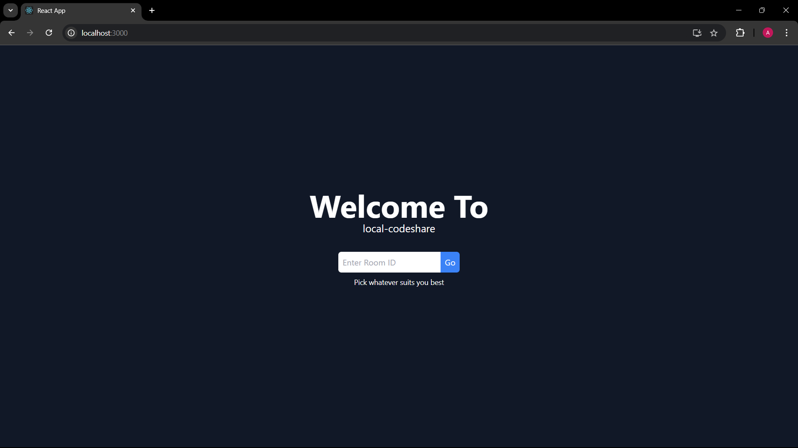
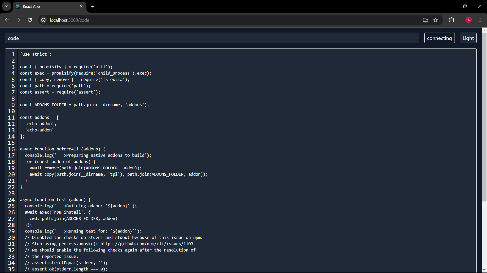

# Local CodeShare

<div style="display: flex; justify-content: space-between;">
  
  
</div>


Local CodeShare is an application designed to facilitate code sharing within the same network or workplace. This application provides an easy way for sharing your code with others, not only in a live manner but also allowing for chatting, communicating, and debugging code in real-time. It also supports making notes or tasks, ensuring everything is scalable. The application is developed using React and Node technologies.

## Features

- **Live Code Sharing**: Share your code in real-time with others.
- **Real-Time Communication**: Chat and communicate with team members while sharing code.
- **Debugging**: Collaboratively debug code with team members.
- **Notes and Tasks**: Create and manage notes or tasks for efficient workflow.
- **Scalability**: Designed to scale with your needs.


## Technologies Used

- **Frontend**: React
- **Backend**: Node.js

## Installation

To install and run the application locally, follow these steps:

1. Clone the repository:
   ```sh
   git clone https://github.com/your-username/local-codeshare.git

2. Navigate to the project directory:
    ```sh
    cd local-codeshare

3. Install dependencies and run the frontend:
    ```sh
    cd codeshare-client
    npm install
    npm start

3. Install dependencies and run the backend:
    ```sh
    cd codeshare-server
    npm install
    npm start

## Usage

    1. Open your web browser and go to `http://localhost:3000`.
    2. Start sharing your code with others in your network or workplace.


